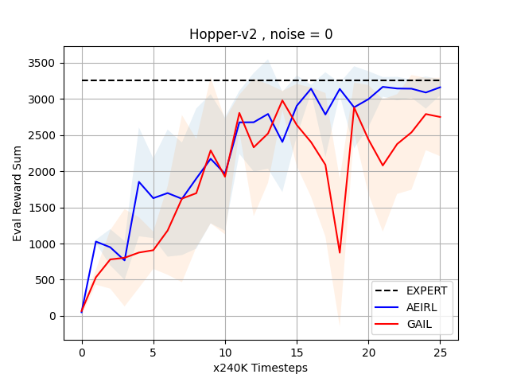

# Auto-Encoding Inverse Reinforcement Learning with PyTorch

This repository is for a simple implementation of Auto-Encoding Inverse Reinforcement Learning (AEIRL) with PyTorch and allows for comparison with GAIL and reproduction of results from the original AEIRL paper [link](https://openreview.net/pdf?id=OCgCYv7KGZe). This implementation is based on this GAIL ([link](https://github.com/hcnoh/gail-pytorch)) implementation

*Note*: The environment's names could be different depending on the version of OpenAI Gym.

## Install Dependencies
1. Install Python 3.
2. Install the Python packages in `requirements.txt`. If you are using a virtual environment for Python package management, you can install all python packages needed by using the following bash command:

    ```bash
    $ pip install -r requirements.txt
    ```

3. Install other packages to run OpenAI Gym environments. These are dependent on the development setting of your machine.
4. Install PyTorch. The version of PyTorch should be greater or equal than 1.7.0.

## Simple Training and Running
1. Execute training process by `train_aeirl.py` or `train_gail.py`. An example of usage for `train_aeirl.py` are following:

    ```bash
    $ python train_aeirl.py --env_name Hopper-v2 --noise 0
    ```
## Launch a comparison experiment between GAIL and AEIRL
1. Excecute both training processes:

    ```bash
    $ python main.py --env_name Hopper-v2 --noise 0 --nb_runs 5
    ```
Data are saved in .txt files in the experiment/ folder .

2. Plot the results:

    ```bash
    $ python plot_from_log.py --env_name Hopper-v2 --noise 0 --experiment_folder experiment/Hopper-v2-0-2022-02-12-02-50-05
    ```
Plots are saved in experiment/Hopper-v2-0-2022-02-12-02-50-05/plot


3. Plot t-sne results:

    ```bash
    $ python plot_tsne.py --env_name Hopper-v2
    ```
Plots are saved in experiment/Hopper-v2-0-2022-02-12-02-50-05/plot

    
## References
- The original GAIL paper: [link](https://arxiv.org/abs/1606.03476)
- AEIRL paper on OpenReview: [link](https://openreview.net/pdf?id=OCgCYv7KGZe)
